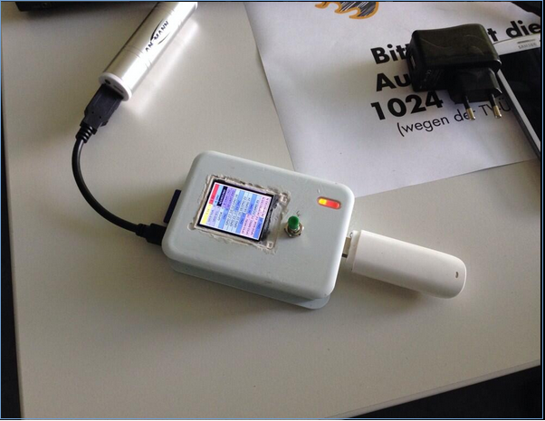

# LPD 24.1 Smarpt
Angelegt Donnerstag 16 Mai 2024

SMARPT ist (war)
**Smart** Dingens  mit **R**aspberry **P**i 
SMARPT ist (war) mobil und mit Multimedia.
Es gibt eine Webseite <https://smarpt.de>
*****
Quelle: Smarpt-Webseite

 Das ist Smarpt3.5
*****
### History
Die 0-version hab ich an der FH-Worms MUXCamp_2014  gezeigt
*****
Quelle: Internet

mobile User Experience … sieht man doch ! 
Noch mehr … <https://www.untergang.de/index.php/konferenzen-thema-linux/mux-camp-worms-2014.html>
*****
UART Schnittstelle funktioniert schon. Reboot vom Smartphone geht.
Video:
<https://www.untergang.de/index.php/liste-linux/raspberry-pi-reboot-now.html>
Hardware:
<https://www.untergang.de/index.php/liste-linux/raspberry-pi-login-ueber-uart.html>
**Es gibt 2 Ausbaustufen**
### **Smarpt1** 2015
Raspberry Pi 1
*****
Quelle: untergang.de

Im Zug nach Trier zur Piandmore UMTS-Stick +Tastatur-Dongle
*****
Quelle: Von einem Besucher

Piandmore 7 in Trier
*****
**Die Folien:** <https://untergang.de/download/folien_smarpt1/>
Video YT : Flappy bird <https://youtube.com/shorts/J5n-Y2fv7_E?feature=shared>
Video YT : Einknopfsteuerung Bildershow <https://youtube.com/shorts/B18oCR9eIzg?feature=shared>
Video YT : Schaltet Steckdosenleiste <https://youtu.be/8t99Yb7Xkxk?feature=shared>
VideoYT ; Menue mit Lagesensor <https://youtu.be/rZu-xz1RPsE?feature=shared>
und 
(Smarpt2 nicht fertig gebaut)
und
### 2017 Smarpt 3(x)
Raspberry Pi 3
*****
Quelle: Smarpt.de

Links: Raspberry Pi, keyboard-Dongle, Pi-cam 
Rechts: Akkupack in der Schublade
*****
**Hardware - Liste Smarpt 3**
Platine : Raspberry Pi 3
Maus : optisch
Gehäuse : grauer Kunststoff
Akku : 4xAA
Display : Touch 3.2" 320 x 240
Kamera : Picam
integriert : Funktastatur Empfänger

Details mit Bilder: <https://smarpt.de/jekyll/update/2017/12/22/mehrdetails.html>
Video YT : Fernsteuerung über WLAN  <https://youtu.be/MjdvEqsZzWc?feature=shared>

