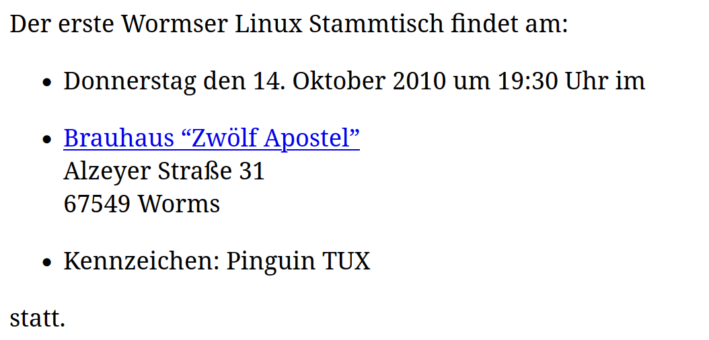
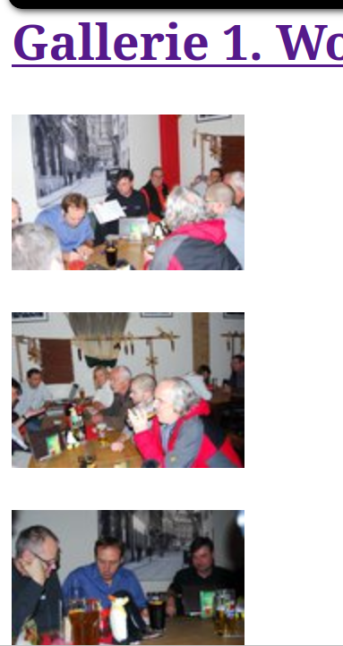
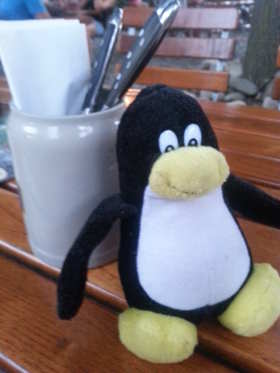
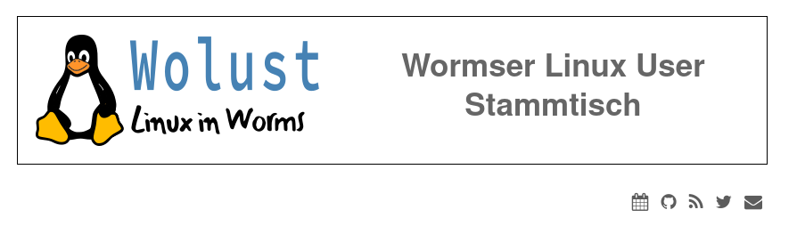
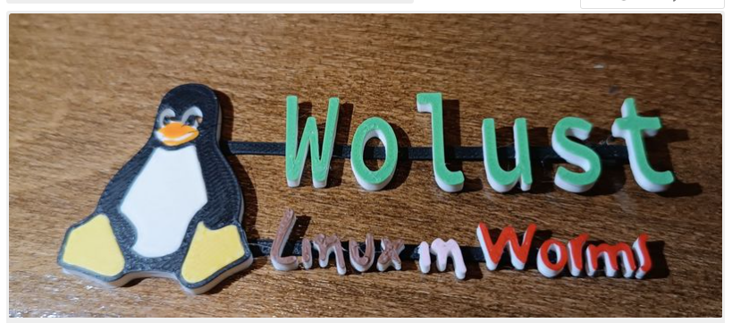

# LPD 24.1 Wolust
Angelegt Donnerstag 16 Mai 2024
Wissenswertes zur LUG in Worms
==============================
**Geschichte von Wolust**
Gegründet wurde WOLUST als **WOLUG von Thomas Peterek**. Am **14. Oktober 2010** trafen wir uns zum ersten mal. **Stefan** war dabei. Rayk und Andreas vom Computerclub Worms kamen am Anfang oft. Uwe Lück hat uns [LaTeX]()
erklärt. War sehr oft dabei.
*****
Quelle Archive.org  Wolug.de (Wordpress)

*****
Am 07.08.2013 kam dann **Mike** dazu. Der kommt auch heute noch regelmäßig zur WOLUST.

Aus Mangel an Linuxusern in Worms und Terminschwierigkeiten haben wir die **WOLUG Ende 2013 aufgelöst**. Reste der damaligen Homepage gibts archive.org
Beim allerletzten Treffen am 24.10.2013 kamen plötzlich ein paar neue Leute. Hoffnung gab es.

Thomas hat die URL der Webseite an eine SEO-Firma verkauft.
Wegen dem grauseligen Inhalt, will ich dashier aber nicht verlinken. 

Dann begann doch die **Linuxfreie Zeit in Worms.  24.10.2013 - 15.10.2015**

15.10.2015 Uwe kommt zu Besuch, und wünscht sich ein außerodentliches WOLUG - Treffen. Und es hat geklappt.
**Am 3.11 2015 gründet sich der Wormser Linux User Stammtisch**

am 06.07.2016 beginnen die Aufzeichnung der neu gegründeten WOLUST mit **Christian ,Mike und Stefan**
*****
Quelle: Wolust.de (noch im Brauhaus)
09.08.2016: Mitgebrachte Kleinstcomputer und Zubehör, 40.000 Rechner für ein Chemiewerk, ZFS, Docker, SAP, Git und mehr.
06.07.2016: Piandmore, Ist Bash eine Programmiersprache und was kann sie. Stammtisch soll flexibler werden. 
*****
Wir haben in Worms mehrere Gastwirtschaften  (24/7,… Stadtcafe) ausprobiert und sind jetzt im Timescafe am Ludwigsplatz, wegen des guten Essens und kostenlosem WLAN.

Juli 2018 haben wir mal für 8 Personen einen Tisch reserviert. Die Gruppen der Linuxuser ist gut gewachsen. Klaus , Nils, Achim

Ab dem **01.10.2018** hat der Christian den Domainnamen **Wolust.de** für uns reserviert. (Jekyll Github)
*****
Quelle: Banner <https://wolust.de>

*****
Seit **Dezember 2019** bekommen wir 3 mal jährlich bei der **Volkshochschule Worms** einen Raum mit Beamer. Die Veranstaltungen dort sind öffentlich und kostenlos. (Wer nicht regelmäßig am Stammtisch teilnimmt, soll sich bitte vorher bei der VHS-Worms anmelden. ) Am 3.12. 2019 fand das Treffen erstmals bei der VHS statt. In den **Coronajahren** haben wir uns meistens online in der **Cloud** der VHS-getroffen (Bigbluebutton). Die Zusammenarbeit mit der VHS ist eingeschlafen.

Ab Anfang 2022 haben wir uns wieder im Timescafe getroffen. **Michael und Tobias** sind jetzt dabei.
Am  06.September 2022 Wolug.de ist wieder zuhause
Am 18.November 2022 haben wir zusammen mit der Hochschule Worms einen “Linux Presentation Day” gemacht.

Im 02.Mai 2023 haben sich 11 Personen an unserem Stammtisch im Timescafe getroffen. Wir wachsen. (2 Tische)
Am 26.Mai 2023 haben wir zusammen mit der Hochschule Worms einen “Linux Presentation Day” gemacht.

Am 24.November 2023 haben wir zusammen mit der Hochschule Worms einen “Linux Presentation Day” gemacht.
2024 **Jan-Luca** ist jetzt schon ein paarmal dabei.
Am 17.Mai 2024  schon wieder LPD
*****
Quelle: 3D-Druck Tobias

